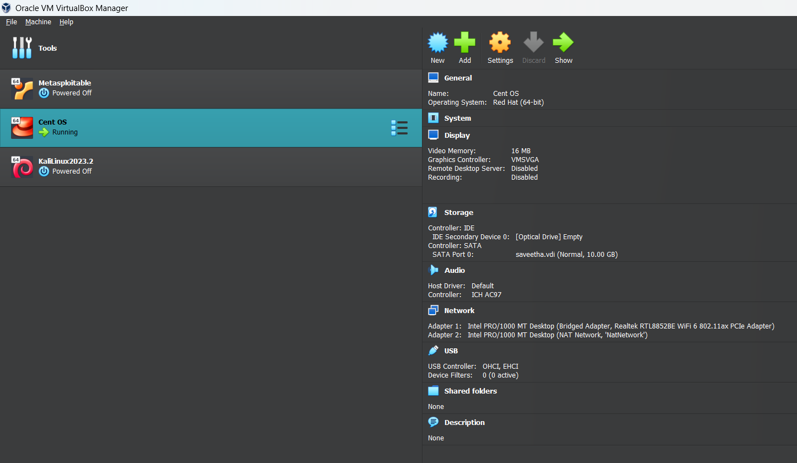
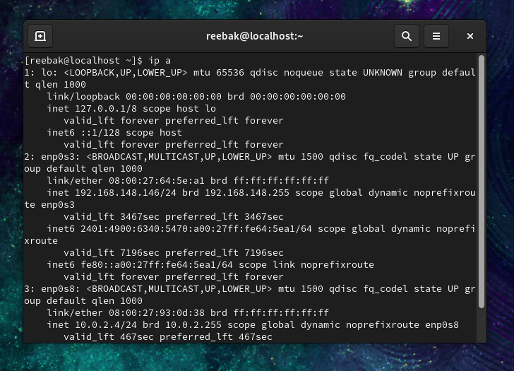

# VIRTUAL MACHINE CREATION IN LINUX
 
## AIM

To install a Linux virtual machine (VM) using CentOS on VirtualBox or VMware Workstation.

## PROBLEM STATEMENT

This experiment involves setting up a virtual machine with CentOS, a popular Linux distribution. This setup allows users to practice Linux commands, test applications, and develop software in a virtualized environment without affecting the host system.

## ALGORITHM

### Step 1:

Open VirtualBox or VMware Workstation</br>
 
### Step 2:
 
Go to File -> New to create a new virtual machine.</br>
 
### Step 3:

Enter a name for your CentOS VM.Choose Linux as the type and CentOS as the version (or select the closest option available if CentOS is not listed).</br>

### Step 4:

Select the CentOS ISO image you downloaded.</br>
 
Set the base memory to 1024 MB (1 GB)</br>
 
Allocate 1 processor core </br>
 
Set the disk size to at least 20 GB</br>
 
Complete the configuration by clicking Finish to create the virtual machine</br>
 
### Step 5:
 
Select the created VM, go to Details (or Settings), and navigate to the Network tab.</br>

Configure Adapter 1 as NAT (for internet access through the host).</br>

Configure Adapter 2 as Bridged Adapter (for direct access to the local network, if needed).</br>

Click OK to save network settings.</br>

### Step 6:

Click Start to boot up the newly created virtual machine.</br>

During installation, set a password for the root user.</br>

After logging in to CentOS, open a terminal to start using the command line.</br>

## COMMANDS

#### Switch to User:

```
su username
```

#### View IP Address:

```
ip a
```

#### Create a Directory:

```
mkdir <directory_name>
```

#### Change to the New Directory:

```
cd <directory_name>
```

#### Edit the Hostname File:

```
vi /etc/hostname
```

#### View the Content of the Hostname File:

```
cat /etc/hostname
```

## OUTPUT

### REG NUMBER: 212222100005
### NAME: ARAVINDHNATH TR





## RESULT

Successfully installed CentOS on a virtual machine using VirtualBox or VMware, providing a fully functional CentOS environment for testing and development.
